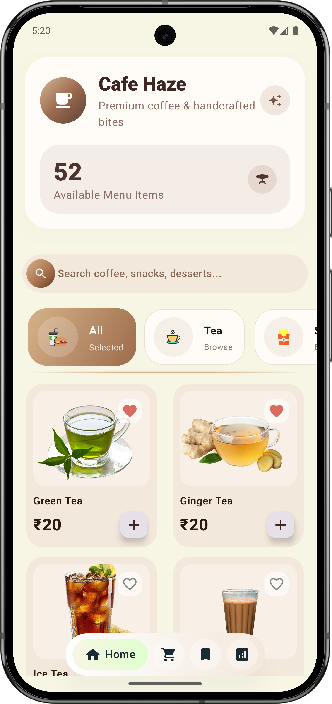
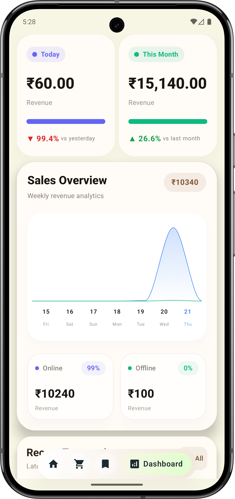
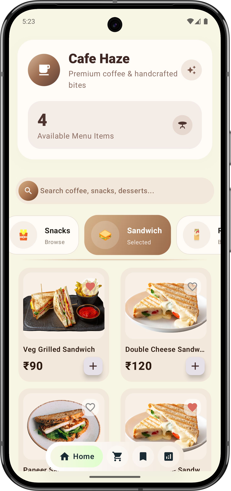
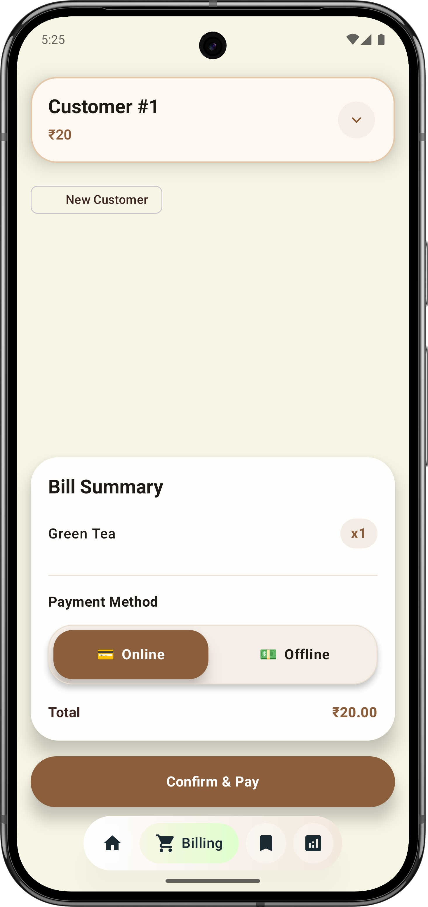
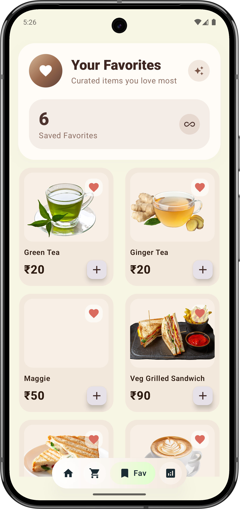
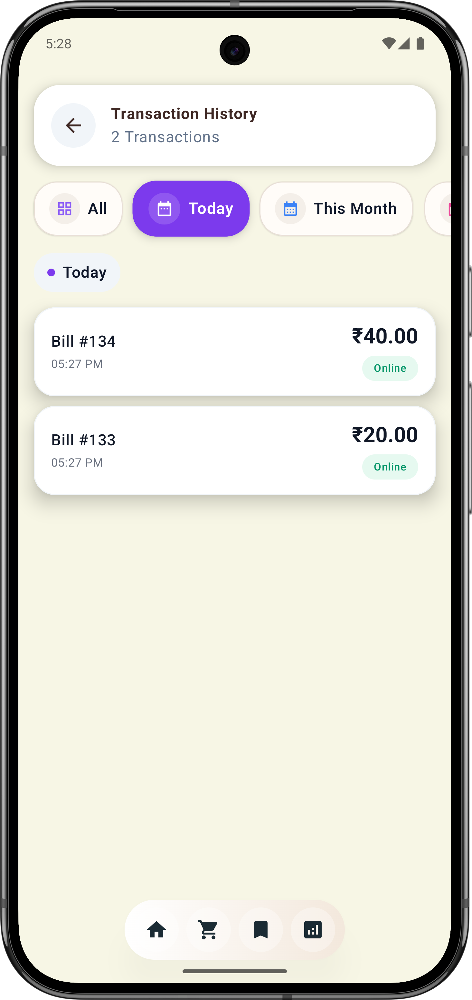
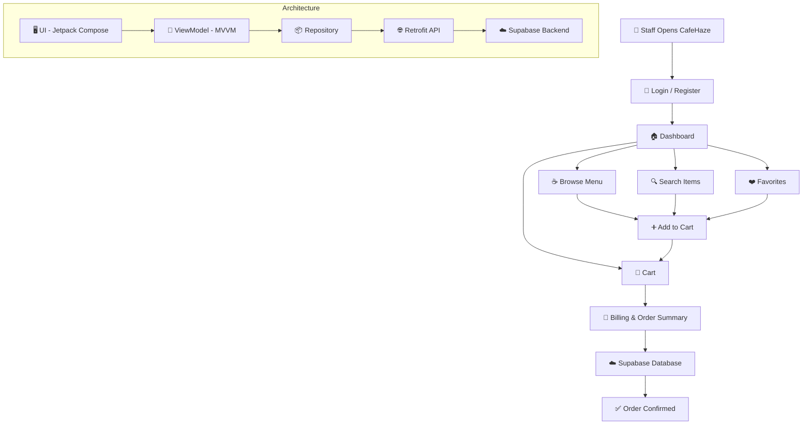

<div id="top">

<!-- HEADER STYLE: CLASSIC -->
<div align="center">


# ☕Cafe Haze

*A Premium Cafe Management App*

<em></em>

<!-- BADGES -->
<!-- local repository, no metadata badges. -->

<em>Built with the tools and technologies:</em>
</div>

<p align="center">
  
  
  
  
  
  
</p>

## 📱App Preview

 |  
 |  
 |  
 |  
 |  
 |  

# Welcome to Cafe Haze

## ✨ Key Features
- 🏡 **Home Screen** – Modern and beautiful home screen.

- 🔍 **Smart Search & Categories** – Quickly find your favorite items.
- ❤️ **Favorites** – Save your favorite drinks and meals for quick access.
- 💲**Smart Billing System** – Easy bill generation with order summary, pricing, total calculation and generate QR for upi payments with all upi apps.
- 🛒 **Easy Recording Cash Flow** – Smooth and seamless food cash flow experience.
- 🖥️ **Dashboard** - Dashboard to learn about sales and analysis it. 
- 📱 **Modern UI Design** – Clean, elegant, and user-friendly interface.
- 🔐 **Secure Authentication** – Safe login and account management.
- ⚡ **Fast Performance**– Optimized for a smooth and responsive experience.
- 🎨 **Premium Café Experience** – Warm, stylish design inspired by modern cafés.

## 🛠️ Tech Stack

- **Kotlin**
- **Jetpack Compose**
- **MVVM Architecture**
- **Hilt Dependency Injection**
- **Retrofit**
- **Supabase**
- **Navigation Component**
- **State Management**
- **Material 3 Design**

## Project Structure
```sh☕ CafeHaze
│
├── 📱 app
│   ├── 📂 src/main
│   │   │
│   │   ├── 📂 java/com/umesh/cafehaze
│   │   │   │
│   │   │   ├── 🚀 di
│   │   │   │   └── AppModule.kt
│   │   │   │
│   │   │   ├── 📦 model
│   │   │   │   ├── 📂 data
│   │   │   │   │   ├── Category.kt
│   │   │   │   │   ├── MenuItem.kt
│   │   │   │   │   ├── CartItem.kt
│   │   │   │   │   ├── User.kt
│   │   │   │   │   └── Order.kt
│   │   │   │   │
│   │   │   │   ├── 📂 repository
│   │   │   │   │   ├── AuthRepository.kt
│   │   │   │   │   ├── MenuRepository.kt
│   │   │   │   │   ├── FavoriteRepository.kt
│   │   │   │   │   ├── CartRepository.kt
│   │   │   │   │   └── BillingRepository.kt
│   │   │   │   │
│   │   │   │   └── ☁️ remote
│   │   │   │       └── SupabaseClient.kt
│   │   │   │
│   │   │   ├── 🎨 ui
│   │   │   │   ├── 🧩 components
│   │   │   │   │   ├── CafeButton.kt
│   │   │   │   │   ├── MenuCard.kt
│   │   │   │   │   ├── CategoryChip.kt
│   │   │   │   │   ├── SearchBar.kt
│   │   │   │   │   ├── CartItemCard.kt
│   │   │   │   │   └── LoadingView.kt
│   │   │   │   │
│   │   │   │   ├── 🧭 navigation
│   │   │   │   │   └── AppNavigation.kt
│   │   │   │   │
│   │   │   │   ├── 🖥️ screens
│   │   │   │   │   ├── 🔐 auth
│   │   │   │   │   │   ├── LoginScreen.kt
│   │   │   │   │   │   └── RegisterScreen.kt
│   │   │   │   │   │
│   │   │   │   │   ├── 🏠 dashboard
│   │   │   │   │   │   └── DashboardScreen.kt
│   │   │   │   │   │
│   │   │   │   │   ├── ☕ menu
│   │   │   │   │   │   ├── MenuScreen.kt
│   │   │   │   │   │   └── MenuDetailScreen.kt
│   │   │   │   │   │
│   │   │   │   │   ├── ❤️ favorites
│   │   │   │   │   │   └── FavoriteScreen.kt
│   │   │   │   │   │
│   │   │   │   │   ├── 🛒 cart
│   │   │   │   │   │   └── CartScreen.kt
│   │   │   │   │   │
│   │   │   │   │   ├── 🧾 billing
│   │   │   │   │   │   └── BillingScreen.kt
│   │   │   │   │   │
│   │   │   │   │   └── 👤 profile
│   │   │   │   │       └── ProfileScreen.kt
│   │   │   │   │
│   │   │   │   └── 🎭 theme
│   │   │   │       ├── Color.kt
│   │   │   │       ├── Theme.kt
│   │   │   │       └── Type.kt
│   │   │   │
│   │   │   ├── 🧠 viewmodel
│   │   │   │   ├── AuthViewModel.kt
│   │   │   │   ├── DashboardViewModel.kt
│   │   │   │   ├── MenuViewModel.kt
│   │   │   │   ├── CartViewModel.kt
│   │   │   │   ├── FavoriteViewModel.kt
│   │   │   │   └── BillingViewModel.kt
│   │   │   │
│   │   │   ├── 🛠️ utils
│   │   │   │   ├── Constants.kt
│   │   │   │   ├── Resource.kt
│   │   │   │   └── Extensions.kt
│   │   │   │
│   │   │   ├── MainActivity.kt
│   │   │   └── MyApp.kt
│   │   │
│   │   ├── 🎨 res
│   │   │   ├── drawable
│   │   │   ├── mipmap
│   │   │   ├── values
│   │   │   └── font
│   │   │
│   │   └── AndroidManifest.xml
│   │
│   ├── ⚙️ build.gradle.kts
│   └── 🔒 proguard-rules.pro
│
├── 📦 gradle
├── ⚙️ build.gradle.kts
├── ⚙️ settings.gradle.kts
├── 🔑 local.properties
└── 📘 README.md
```


## ☕ How CafeHaze Works


## 📋 App Management
- [x] Homescreen
- [x] Billing 
- [x] Favourites
- [x] Dashboard
- [x] Transactions History 

## 🚀 Getting Started

### 📋 Prerequisites

Before running **CafeHaze**, make sure you have:

- **Android Studio** (Latest Stable Version)
- **JDK 17+**
- **Android SDK**
- **Supabase Project Setup**
- Internet connection for API/database access

---

## ⚙️ Installation & Setup

### 1️⃣ Clone the Repository

```bash
git clone https://github.com/your-username/CafeHaze.git
cd CafeHaze
```

### 2️⃣ Open in Android Studio

- Open **Android Studio**
- Click **Open**
- Select the **CafeHaze** project folder

---

### 3️⃣ Configure Supabase

Create or update your `local.properties` file:

```properties
SUPABASE_URL=your_supabase_url
SUPABASE_KEY=your_supabase_anon_key
```

> Make sure **Row Level Security (RLS)** is enabled in Supabase.

---

### 4️⃣ Sync Gradle

Let Android Studio:

- Download dependencies
- Sync Gradle automatically

Or manually run:

```bash
./gradlew build
```

---

## ▶️ Run the App

### Run on Emulator

1. Open **Android Studio**
2. Start an Android Emulator
3. Click **Run ▶**

### Run on Physical Device

1. Enable **Developer Options**
2. Enable **USB Debugging**
3. Connect your Android phone
4. Click **Run ▶**

---

## ☕ How to Use CafeHaze

### 🔐 Authentication
- Register a new account or login securely.

### 🏠 Dashboard
- Browse featured coffee and café categories.

### ☕ Explore Menu
- View coffee, beverages, snacks, and desserts.

### ❤️ Favorites
- Save your favorite menu items.

### 🛒 Cart
- Add items to cart and manage quantities.

### 🧾 Billing
- View order summary and billing details.

### ✅ Place Order
- Confirm your order seamlessly.

---

## 🛠️ Build APK

Generate APK using:

```bash
./gradlew assembleDebug
```

Generated APK path:

```txt
app/build/outputs/apk/debug/app-debug.apk
```

## 🚀 Future Improvements

- 💳 Payment Integration
- 📍 Order Tracking
- 🔔 Push Notifications
- 🌙 Dark Mode
- 🧾 Invoice Download
- 🤖 AI-based Recommendations

## 🛡️ License 

This project is licensed under the MIT License.